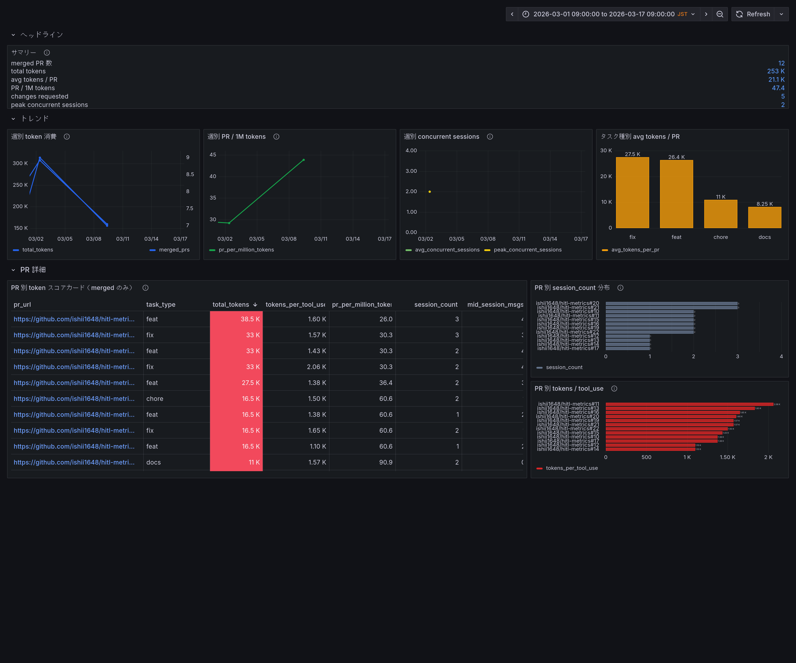
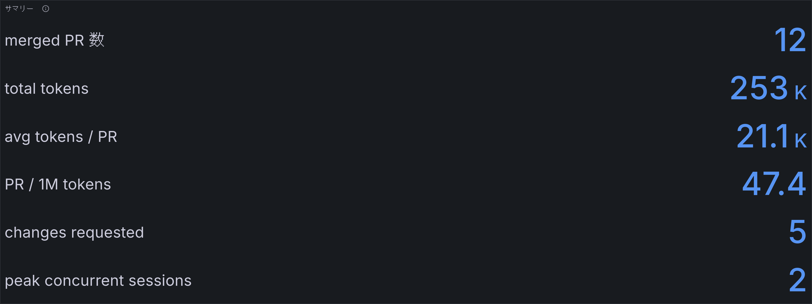
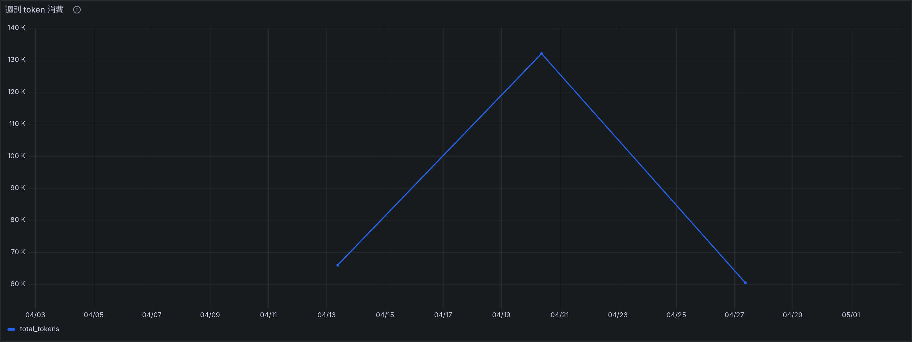
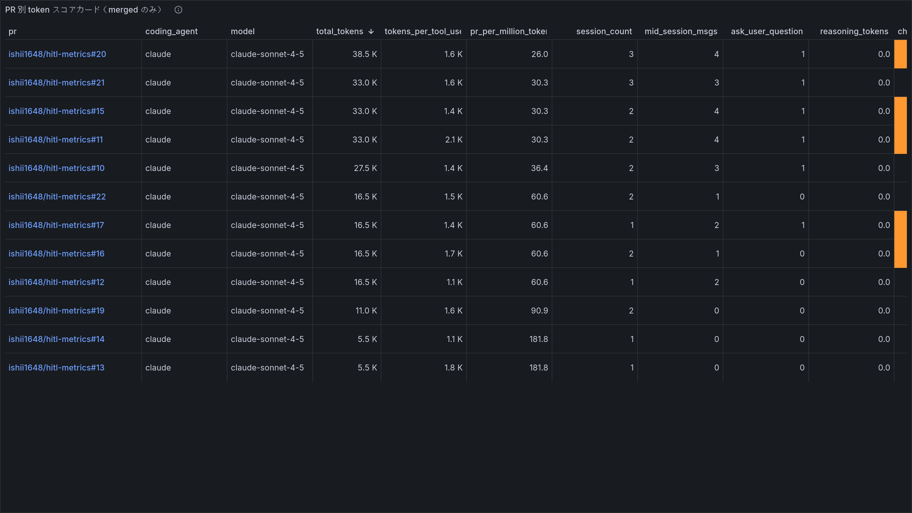

# hitl-metrics

Claude Code を使った開発で、**PR 単位のトークン消費効率**を追跡・可視化する計測ツール。

merged PR ごとに Claude Code が消費した input / output / cache token を集計し、どの PR が重く、どのタスク種別で効率が落ちているかを特定します。



ダッシュボードは3つのセクションで構成されています。上から順に読むだけで「どれだけ使ったか → 改善しているか → どの PR が重いか」がわかります。

---

### 1. ヘッドライン — 今の消費効率を一目で



merged PR 数、total tokens、平均 tokens / PR、PR / 1M tokens、changes requested 数を表示します。平均 tokens / PR が下がり、PR / 1M tokens が上がっていれば、同じ計算資源でより多くの PR を完了できています。

### 2. トレンド — 改善しているか



週ごとの token 消費、merged PR 数、PR / 1M tokens を表示します。横に並ぶタスク種別バーで feat/fix/docs/chore ごとの token 消費傾向も確認できます。

### 3. PR 詳細 — どこが重いか



各 PR の token 指標を total_tokens の高い順に表示します。tokens_per_tool_use が高ければ文脈肥大、session_count や mid_session_msgs が多ければタスク分割や要件伝達に改善余地があります。

---

## 計測する指標

| 指標 | 意味 |
|------|------|
| **total_tokens** | PR に紐づく input / output / cache write / cache read token の合計 |
| **tokens_per_session** | 1 セッションあたりの token 消費量 |
| **tokens_per_tool_use** | 1 tool_use あたりの token 消費量。文脈肥大の代理指標 |
| **pr_per_million_tokens** | 100万 token あたりに完了できた PR 数。高いほど効率的 |
| **mid_session_msgs** | ユーザーが途中で方向転換した回数。要件の曖昧さの代理指標 |
| **ask_user_question** | Claude がユーザーに質問した回数。仕様不明瞭さの指標 |
| **session_count** | PR に紐づくセッション数。作業の完了困難さの指標 |
| **peak_concurrent_sessions** | 期間内のトップレベル Claude Code セッション最大同時実行数 |
| **avg_concurrent_sessions** | 期間内のトップレベル Claude Code セッション平均同時実行数 |
| **review_comments** | PR レビューコメント数。成果物品質の外部フィードバック |
| **changes_requested** | CHANGES_REQUESTED レビュー回数 |
| **task_type** | ブランチプレフィックス (feat/fix/docs/chore) から自動抽出 |

## アーキテクチャ

```
Claude Code hooks → ~/.claude/session-index.jsonl + transcript JSONL → hitl-metrics sync-db → SQLite → Grafana
```

1. **データ収集層** (`hooks/`) — Claude Code hook で session イベントを記録
2. **データ変換層** (`cmd/hitl-metrics/`, `internal/`) — Go CLI で JSONL/transcript → SQLite 変換・PR URL 補完
3. **可視化層** (`grafana/`) — Grafana ダッシュボードで PR 単位の token 効率を表示

## セットアップ

→ [docs/setup.md](docs/setup.md)
