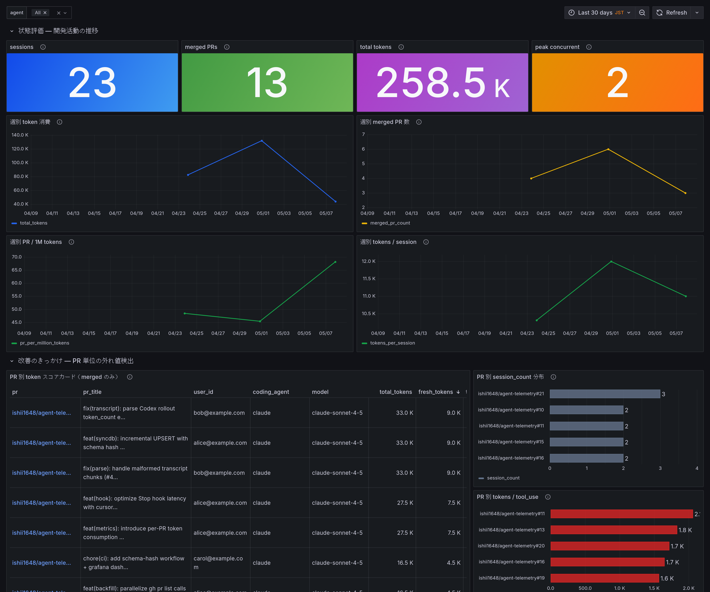

# agent-telemetry

Claude Code および Codex CLI を使った開発で、**PR 単位のトークン消費効率**を追跡・可視化する計測ツール。

## ドキュメント

仕組みの解説・セットアップ手順・運用ガイドは GitHub Pages で公開しています:

**→ [agent-telemetry site](https://ishii1648.github.io/agent-telemetry/)**

- [仕組み解説](https://ishii1648.github.io/agent-telemetry/explain/) — アーキテクチャ・データフロー・観察軸・dashboard の読み方
- [セットアップ](https://ishii1648.github.io/agent-telemetry/setup/) — local / server

## Contributor 向け reference

| 場所 | 内容 |
|---|---|
| [docs/spec.md](docs/spec.md) | 外部契約（CLI・hook 仕様・データモデル） |
| [docs/metrics.md](docs/metrics.md) | 計測フレームワーク（観察軸・解釈・OpenMetrics カタログ） |
| [docs/design.md](docs/design.md) | 実装方針と設計判断 |
| [issues/closed/](issues/closed/) | 過去の意思決定記録（retro issue を含む正本） |
| [site/](site/) | site の Hugo source（`make docs-serve` でローカル確認） |
