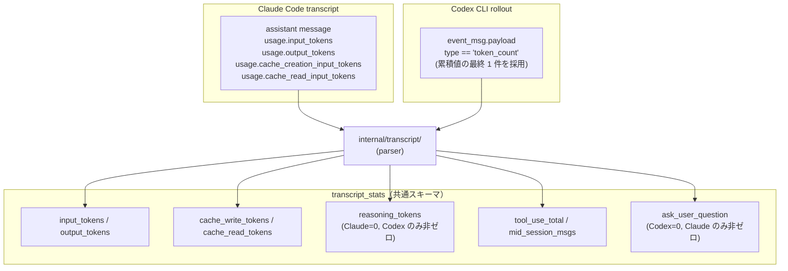
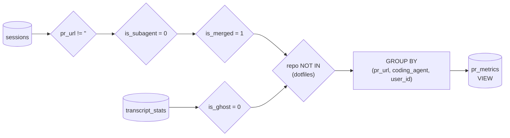

JSONL に記録された生イベントが **PR 単位の指標**に変わるまでを追います。Claude / Codex の transcript フォーマットの違いをどこで吸収しているか、`pr_metrics` VIEW のフィルタが何を弾いているかを把握できます。

セッション 1 本のライフサイクル（いつ hook が発火し、いつ PR に pin されるか）は [hooks]() に集約しています。本ページは hook が JSONL に書き込んだ**後**、CLI と SQL VIEW がどう加工するかに絞ります。

## agent ごとの transcript パース

Claude と Codex で transcript フォーマットは異なります。**`internal/transcript/`** がフォーマット差異を吸収して `transcript_stats` の共通カラムに落とし込みます。

差異の扱い:

| 軸 | Claude | Codex |
|---|---|---|
| token 集計の単位 | message ごとの `usage` を**合算** | rollout の `token_count` イベントの**最終累積値**を採用 |
| `reasoning_tokens` | 常に 0 | 非ゼロを取りうる |
| `ask_user_question` | 非ゼロを取りうる | 常に 0（Codex に該当 tool 概念がないため） |
| transcript ファイル | `~/.claude/projects/**/<session-id>.jsonl` | `~/.codex/sessions/YYYY/MM/DD/rollout-*.jsonl[.zst]` |

zstd 圧縮された Codex rollout は decoder を通して読みます（`klauspost/compress/zstd`）。

## sessions → pr_metrics の集約

`pr_metrics` VIEW で PR 単位に集約します。フィルタを通過したセッションだけが指標に乗ります。

なぜこのフィルタか:

- `pr_url != ''` — PR 未作成セッションを除外（PR 単位の効率を見るため）
- `is_subagent = 0` — サブエージェントセッションは親と二重計上になるので除外
- `is_merged = 1` — 未マージ・放棄 PR は最終成果物ではないため除外
- `is_ghost = 0` — ユーザー発話相当が 0 件のセッション（環境調査だけで終わった等）を除外
- dotfiles 除外 — agent-telemetry の運用上の自明なノイズ

集約軸が `(pr_url, coding_agent, user_id)` の 3 軸なのは、同一 PR が複数 agent / 複数ユーザに触られたケース（pair coding 等）を意味的に分離するためです。実運用上ほぼ発生しませんが、起きたときに合算してしまうと指標が歪むので分離しています。
