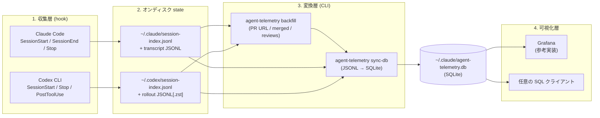

agent-telemetry は 3 つの層で構成されます。各層の責務を分離してあるので、収集元の追加（新しい coding agent）や可視化先の差し替え（Grafana 以外）は、層をまたいだ変更を最小化できます。

## 全体図

## 各層の責務

### 1. 収集層（hook）

各 agent の hook が**セッションメタデータ**と**transcript**を agent ごとのデータディレクトリに書き出します。hook 自体はメトリクスを計算しません。**生イベントの保存**だけを担当します。

| agent | データディレクトリ | hook の登録先 |
|---|---|---|
| Claude Code | `~/.claude/` | `~/.claude/settings.json` |
| Codex CLI | `~/.codex/`（または `$CODEX_HOME`） | `~/.codex/config.toml` または `~/.codex/hooks.json` |

hook の詳細は [hooks]() ページを参照してください。

### 2. オンディスク state

| ファイル | 役割 |
|---|---|
| `session-index.jsonl` | セッション 1 件 = 1 行の JSON。session_id / repo / branch / PR URL などを記録 |
| transcript JSONL（Claude） | assistant message ごとの token usage を含むフルトランスクリプト |
| rollout JSONL[.zst]（Codex） | `event_msg.payload.type == "token_count"` で累積 token を記録 |
| `agent-telemetry-state.json` | backfill の cursor。再 API 呼び出しを抑制 |

これらは agent ごとに**完全に分離**されており、単一の agent しか使わない環境でも他方は不要です。

### 3. 変換層（`agent-telemetry` CLI）

CLI は state を読んで SQLite に変換します。

- **`backfill`** — `gh` CLI を呼んで PR URL / merged / レビューコメント数などを補完。cursor を進めて再 API 呼び出しを避ける
- **`sync-db`** — JSONL と transcript を読んで `sessions` / `transcript_stats` を `INSERT OR REPLACE` で upsert（毎回フル再構築）

`Stop` hook は応答完了時に `backfill` → `sync-db` を**ブロッキング**で実行します。応答が返ってくるまでに DB が最新化される設計です。

### 4. 可視化層

DB は `~/.claude/agent-telemetry.db` 1 ファイルに集約されます（agent は `coding_agent` カラムで区別）。`pr_metrics` VIEW が PR 単位の集約を提供するので、Grafana / DBeaver / `sqlite3` CLI など SQLite を読める任意のクライアントで参照可能です。

リポジトリ同梱の Grafana dashboard はあくまで**参考実装**です。panel 構成は `grafana/dashboards/agent-telemetry.json` を直接参照してください。

## なぜこの構成か

- **agent ごとに収集元を分離、DB は集約** — 新規 agent を追加するときに既存の収集経路を壊さない。一方で集計は単一テーブルで完結する
- **hook は計算しない** — hook は agent プロセスをブロックする位置にあるので、永続化以外の計算を入れない方針。集計は CLI 側で `sync-db` 実行時に行う
- **`sync-db` は毎回フル再構築** — 差分更新のバグを設計から排除。スキーマハッシュが一致する限り `INSERT OR REPLACE` で安全に再生できる
