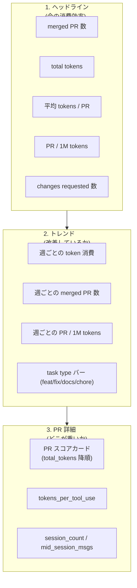
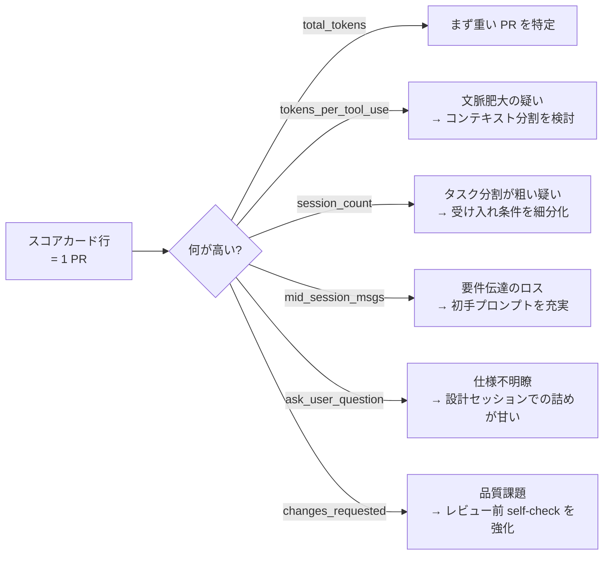

# Dashboard

リポジトリ同梱の Grafana dashboard（`grafana/dashboards/agent-telemetry.json`）の panel ごとの読み方をまとめます。**dashboard はあくまで参考実装**です。`pr_metrics` VIEW を読める SQL クライアントなら同じ指標を任意の方法で可視化できます。

## dashboard の構造



上から順に「**どれだけ使ったか → 改善しているか → どの PR が重いか**」と読み下せるよう並べてあります。

## 1. ヘッドライン

| panel | 何を見るか | 解釈 |
|---|---|---|
| **merged PR 数** | 期間内に merge された PR の合計 | 単純な活動量の指標 |
| **total tokens** | 期間内に消費した合計 token | 課金体感に最も近い |
| **平均 tokens / PR** | total_tokens / merged_pr_count | 1 PR をこなすコストの中央感。**下げたい指標** |
| **PR / 1M tokens** | 1,000,000 token あたりに完了した PR 数 | 効率の表裏指標。**上げたい指標** |
| **changes requested 数** | レビューで `CHANGES_REQUESTED` がついた回数 | 成果物品質の外部フィードバック |

「平均 tokens / PR が下がり、PR / 1M tokens が上がっていれば、**同じ計算資源でより多くの PR を完了できている**」というのが効率改善の定義です。

## 2. トレンド

トレンドは**週単位**で集約します（日単位だとノイズが大きく、月単位だと反応が遅すぎる）。

| panel | 何を見るか |
|---|---|
| 週ごとの token 消費 | 投入量の推移。チームのスケール変化や繁忙期を読む |
| 週ごとの merged PR 数 | 完了量の推移 |
| 週ごとの PR / 1M tokens | 効率の推移。**この線が上向きなら改善** |
| task type バー | feat / fix / docs / chore ごとの token 消費傾向 |

`task_type` は **集計軸ではなく内訳の参考表示**として使います（ADR-024 で「定量指標は task_type を集計軸に使わない」方針が採用されたため）。task type ごとの中央値で比較すると、PR の規模差を `task_type` のラベルが吸収してしまい結論を誤りやすいからです。

## 3. PR 詳細（スコアカード）

各 PR の指標を `total_tokens` 降順で表示します。**重い PR を上から潰す**運用が想定されています。



各指標の解釈:

| 指標 | 高いと何が起きているか | 改善アクション |
|---|---|---|
| `total_tokens` | 単純に重い PR | スコープ縮小・分割の検討 |
| `tokens_per_tool_use` | tool 1 回あたり読み込んでいる context が大きい | コンテキストを explicit に絞る・参照ファイルを限定 |
| `tokens_per_session` | 1 セッションあたりの消費が大きい | セッションを短く区切る |
| `session_count` | セッションを跨いで作業している | 受け入れ条件を再分割。1 issue = 1 session に近づける |
| `mid_session_msgs` | セッション中に方向転換が多い | 初手プロンプトで前提・ゴール・制約を明示 |
| `ask_user_question` | agent が質問した回数（Claude のみ） | 設計セッションで仕様を詰めてから実装に入る |
| `peak_concurrent_sessions` | 同時実行のピーク | 並列度の上限。瞬間的な計算資源消費の参考 |

`ask_user_question` は **Claude にのみ存在**します（Codex に該当 tool 概念がないため Codex セッションでは常に 0）。

## fixture でのスクリーンショット再現

dashboard の panel が壊れていないかは E2E で検証します。

```bash
make grafana-screenshot
```

`grafana-up-e2e` 経由で fixture data（`e2e/testdata/agent-telemetry.db`）を mount するので、画像が決定的に再現されます。表示変更を入れた場合は **必ずスクリーンショット（`docs/images/dashboard-*.png`）を更新**してください。詳細は [docs/usage.md](https://github.com/ishii1648/agent-telemetry/blob/main/docs/usage.md) を参照。

## panel と DB スキーマの対応

dashboard が読んでいるのは `pr_metrics` / `session_concurrency_weekly` / `session_concurrency_daily` の 3 VIEW です。生テーブル（`sessions` / `transcript_stats`）は直接参照しません。VIEW のフィルタ・集約軸の詳細は [data-flow]() ページを参照してください。

スキーマ DDL の最新は [docs/spec.md](https://github.com/ishii1648/agent-telemetry/blob/main/docs/spec.md) を正とします。
