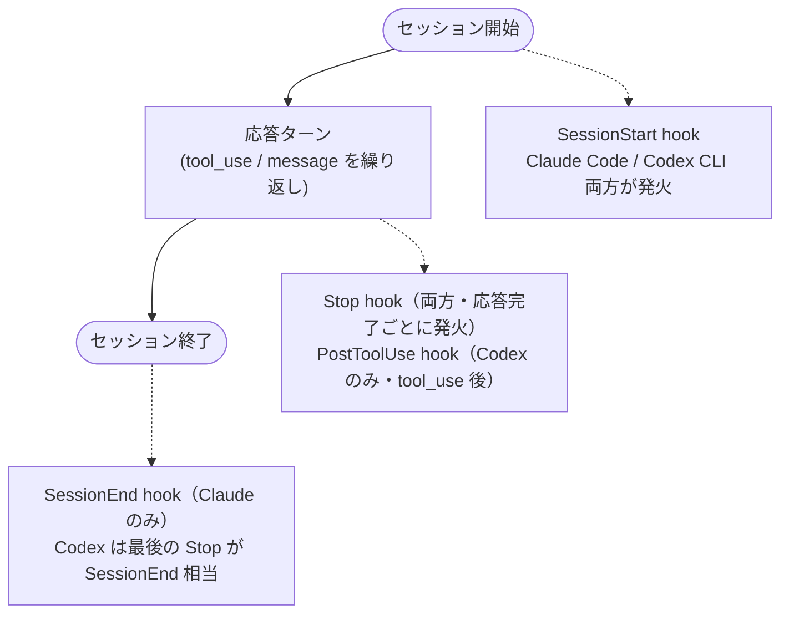
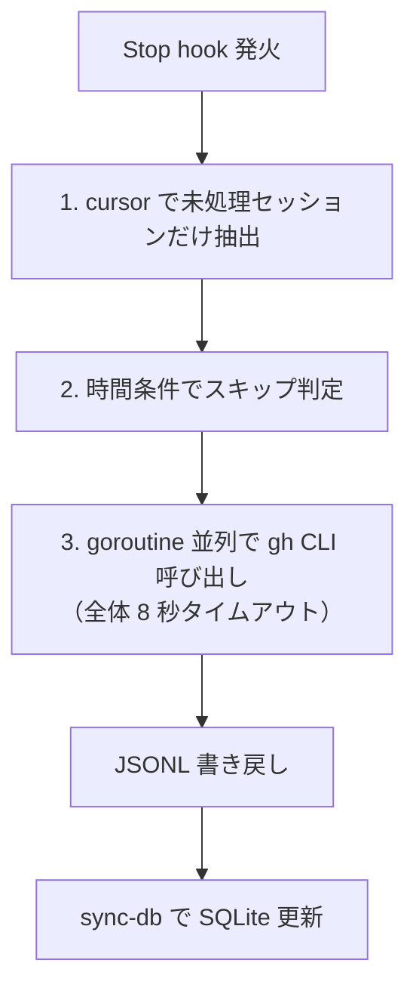
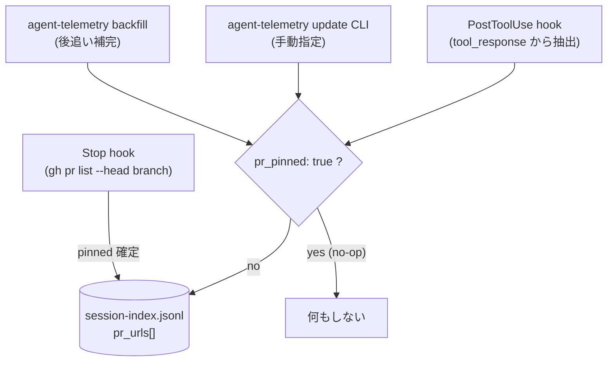

agent-telemetry が登録する hook の一覧と、それぞれが**何のイベントを契機に・何のデータを集めるか**をまとめます。hook は agent プロセスから同期的に呼ばれ、**JSONL への追記から `backfill`・`sync-db` による SQLite 反映までを 1 回の hook 実行内で完結**させます（後続バッチが無いため、ここで sync しないと Grafana に反映されない）。応答時間への影響は [Stop hook の処理時間](#stop-hook-の処理時間) で説明する 3 つの抑制策で抑えています。

## hook がカバーする範囲

Codex は `SessionEnd` を持たないため、`Stop` hook で `ended_at` を毎回上書きします。最後に発火した `Stop` がそのまま「終了時刻」になります。

## hook と用途の対応表

`agent-telemetry hook <event> --agent <claude|codex>` のサブコマンド形式で呼ばれます。`agent-telemetry` バイナリが PATH 上に必要です。

### Claude Code

| hook | サブコマンド | 用途 |
|---|---|---|
| `SessionStart` | `hook session-start --agent claude` | セッション開始メタデータ（`session_id` / `cwd` / `repo` / `branch` / `user_id`）を `~/.claude/session-index.jsonl` に追記 |
| `SessionEnd` | `hook session-end --agent claude` | `ended_at` / `end_reason` を確定し `sync-db` を実行 |
| `Stop` | `hook stop --agent claude` | branch から PR を解決して `pr_pinned: true` で確定 → `backfill` → `sync-db`（ブロッキング） |

### Codex CLI

| hook | サブコマンド | 用途 |
|---|---|---|
| `SessionStart` (`startup` / `resume`) | `hook session-start --agent codex` | セッション開始メタデータを `~/.codex/session-index.jsonl` に追記 |
| `PostToolUse` | `hook post-tool-use --agent codex` | `tool_response` 文字列から PR URL を抽出して `pr_urls` に追記（`pr_pinned: true` のセッションでは no-op） |
| `Stop` | `hook stop --agent codex` | branch から PR を解決して `pr_pinned: true` で確定し `ended_at` を更新 → `backfill` → `sync-db`（ブロッキング） |

## `Stop` hook の処理時間

`Stop` hook は応答完了ごとに `backfill` → `sync-db` をブロッキングで走らせます。応答が長引かないよう **3 つの抑制策**が入っています。

| 抑制策 | 効果 |
|---|---|
| cursor 方式 | 既に `backfill_checked: true` のセッションは再 API 呼び出ししない |
| 時間条件スキップ | 直近 N 分以内に走った場合はスキップ |
| goroutine 並列 | 複数セッションの `gh pr view` 等を並列発行 |
| 8 秒タイムアウト | 全体で 8 秒以上かかったら強制打ち切り（hook 完了を優先） |

それでも長引く環境では `Stop` を非同期化するアイデアもあるが、**「応答が返る頃には DB が最新」**という整合性を優先して同期実行に振っています。

## PR と session の紐づけ

PR 単位のメトリクス（`pr_metrics` など）が成立するには、**どの session がどの PR に属するか** を確定する必要があります。hook と CLI が次の順で確定させ、確定後の混入は仕組みで弾く設計です。

### 確定までの 3 ステップ

1. **SessionStart hook** が `branch` / `cwd` / `repo` を session-index.jsonl に記録する（揮発しない事実）
2. **Stop hook** が応答完了時に `gh pr list --head <branch> --author @me --limit 1` を 8 秒タイムアウトで叩き、1 件取れたら `pr_urls = [url]` + `pr_pinned: true` で **pin** する。同じレスポンスから `is_merged` / `review_comments` / `changes_requested` / `title` も seed
3. **`agent-telemetry backfill` Phase 1** が pin できなかった session を `(repo, branch)` 単位でグループ化して再試行する fallback 経路。永続的に PR が無いブランチ（main / master 等）は `backfill_checked = true` で永続スキップ

### pin 後の混入を弾く（URL 解決の優先順位）

PR URL は複数の経路から到達するため、衝突を避けるために優先順位が決まっています。

`Stop` hook が `pr_pinned: true` を立てた後は、他経路からの URL 追記は **すべて no-op** になります。これにより以下のような事故を排除できます。

- **branch とは無関係に PR URL が混入する** — PR コメントに別 PR のリンクを貼った瞬間に `PostToolUse` が誤検出する等
- **同一ブランチで別 PR を使い回す運用** — 新 PR の URL が古いセッションに付与される
- **Bash 出力に含まれた他人の PR URL** を `pr_urls` 末尾に拾うケース — `sync-db` は末尾を採用するため誤接続が起きる

## hook 登録のしくみ

`agent-telemetry setup` は登録例を**表示するだけ**で、自動書き込みはしません。ユーザーが dotfiles または手動で登録する前提です。

- Claude Code: `~/.claude/settings.json` の `hooks` セクションに追記
- Codex CLI: `~/.codex/config.toml` に `[features] codex_hooks = true` を立てたうえで `[[hooks.<Event>]]` を追加、または `~/.codex/hooks.json` を配置

過去 `agent-telemetry install` 系統で自動登録された hook がある場合は、`agent-telemetry doctor` の legacy hook warning を頼りに手動で削除してください（自動削除は提供しません）。

具体的なセットアップ手順は [setup/local]() を参照してください。
