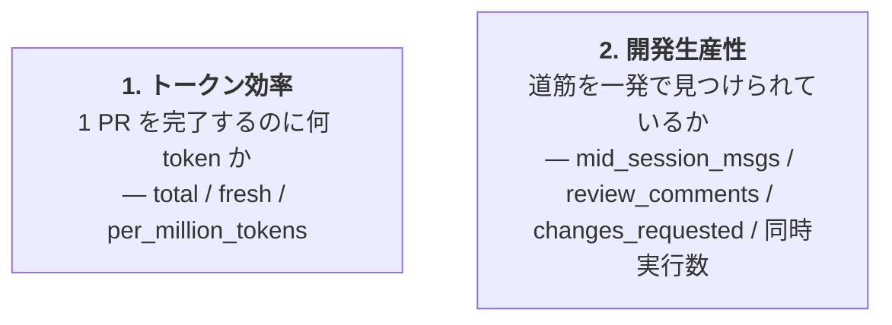
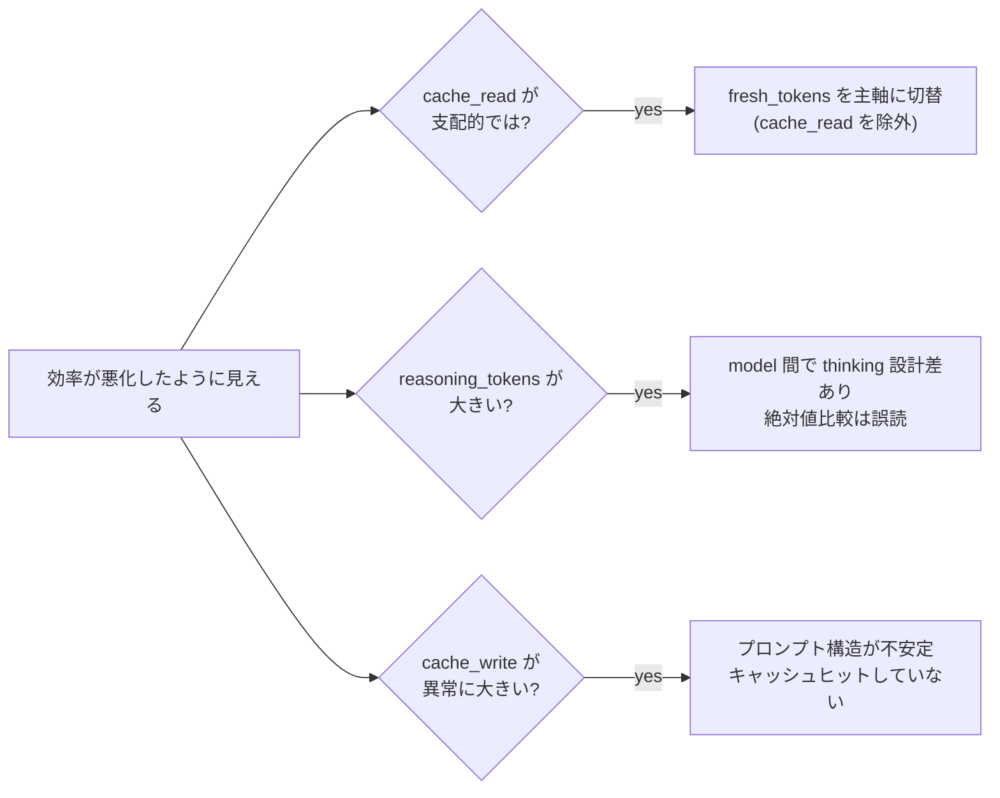
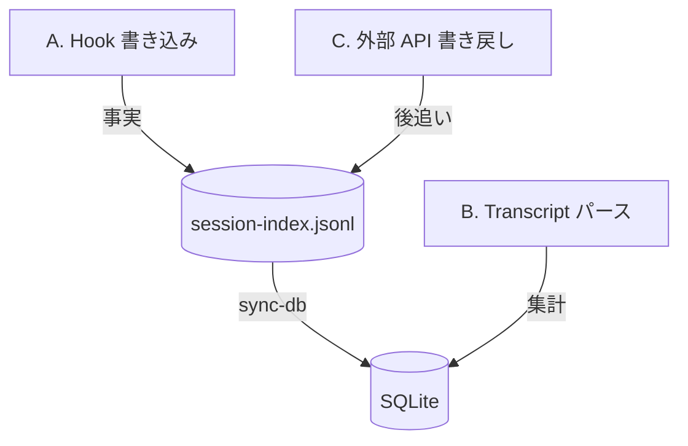

agent-telemetry が **何を観察しているか・なぜそれを選んだか** を整理します。個別メトリクスの型・ラベル・SQL カラムとの対応はすべて [docs/metrics.md](https://github.com/ishii1648/agent-telemetry/blob/main/docs/metrics.md) を正本とし、本ページは「観察軸の見取り図」と「読み誤りやすい落とし穴」に絞ります。

## 観察軸の見取り図

メトリクスは 2 つの主軸で配置されます。`pr_metrics` VIEW のフィルタ（merged のみ・subagent / ghost / dotfiles 除外）はどちらの軸にも効く前提です。

軸ごとに「答えたい疑問」と「主要指標」を並べると次のとおりです。

| 軸 | 答えたい疑問 | 主要指標 |
|---|---|---|
| 1. トークン効率 | 1 PR を完了するのに何 token かかっているか | `agent_pr_total_tokens` / `agent_pr_fresh_tokens` / `agent_pr_per_million_tokens` |
| 2. 開発生産性 | 詰まらず PR をマージまで到達させられているか | `agent_session_mid_session_msgs_total` / `agent_pr_changes_requested` / `agent_concurrent_sessions_peak` |

## 落とし穴

軸を 2 つ提示しただけで読み手に渡すと、**指標の絶対値や増減を素直に良し悪しと結びつけてしまう** 誤読が起きやすくなります。これは以下に起因します。

- **キャッシュ・thinking の構成変化** で token 系の見かけが大きくぶれる
- **PR の性質差**（リファクタ vs feature など）を平均で潰すと意味を失う

主軸 2 つの軸別に、典型的な誤読パターンと回避策を並べます。

### トークン効率

「効率が悪化したように見える」きっかけはほぼ次の 3 パターンに分解できます。先に分岐で当たりをつけてから絶対値を見るのが安全です。

| 落とし穴 | 対処 |
|---|---|
| `cache_read_tokens` が大きい = 効率が良い、と読みがち | 長大なコンテキストで自然と増える側面があるため、**`fresh_tokens` を主軸**にする運用が安全 |
| `total` と `fresh` どちらを使うか迷う | 課金や物理 token 量を見たいなら `total`、実質的な作業量を見たいなら `fresh` |
| `tokens_per_tool_use` の絶対値で良し悪しを判定 | 単独では評価不能。**異常検出と内訳分解の補助**として使う（例: 高 reasoning × 低 tool_use_total = 思考の空回り） |
| `cache_write_tokens` の急増 | キャッシュヒットしておらず毎回書き直している兆候。プロンプト構造の安定性を疑う材料 |
| リファクタ系 PR と feature 系 PR を平均で比較 | 性質が違いすぎる。`task_type` フィルタか PR 別スコアカードで個別に見る |

### 開発生産性

token と違い「人間との対話量」が混ざるので、レビュア・PR 規模・並列状況などの **文脈で同条件に揃えてから** 比較する必要があります。

| 指標 | 高いと何が起きているか | 注意 |
|---|---|---|
| `mid_session_msgs` | エージェントが正しい道筋を見つけられない／ユーザが auto を信用しきれていない | 初手プロンプトの前提・ゴール・制約の明示で減らせる |
| `ask_user_question` | 仕様不明瞭 | **Claude のみ計上**。Codex は 0 固定なので agent 跨ぎ比較不可 |
| `changes_requested` | レビュー差し戻し | 人間レビュアの厳しさ・PR 規模に依存。同一レビュア・同一規模帯での時系列比較が安全 |
| `concurrent_sessions_peak` | 並列度の上限 | peak が高い時期に token 効率が落ちていれば「並列やりすぎ」のサイン |

`ended_at` が空のセッションは現在時刻で打ち切る扱いのため、**進行中セッションを含む時間帯は同時実行数が膨らみます**。

## 計測の実務

落とし穴を踏まえると、軸ごとに **主指標・ベースライン・ドリルダウン経路** がほぼ決まります。

| 観点 | トークン効率 | 開発生産性 |
|---|---|---|
| 主指標 | `agent_pr_fresh_tokens`（cache 揺らぎを除き、作業量に近い値） | `mid_session_msgs`（agent 側の迷い）+ `changes_requested`（レビュア側の摩擦） |
| ベースライン | 同 `task_type` 内の中央値 | 同レビュア・同規模帯（`additions+deletions` のバンド） |
| ドリルダウン | PR → session → 内訳（input / output / cache_write / reasoning）→ transcript | PR → session の `mid_session_msgs` 推移 → transcript の人間介入局面 |
| 時系列比較で固定するラベル | `model` / `agent_version` | `coding_agent` / レビュア |

両軸を交差させる典型的な観察は **並列稼働の評価**: `concurrent_sessions_peak` が高い期間に `fresh_tokens / PR` も悪化していれば「並列詰め込み過ぎ」のサインです。

具体的なクエリとパネル定義は [grafana/dashboards/agent-telemetry.json](https://github.com/ishii1648/agent-telemetry/blob/main/grafana/dashboards/agent-telemetry.json) を参照してください。

## 3 収集カテゴリ

メトリクスは 30+ ありますが、**どこで値が確定するか** で 3 つに分類できます。コードを読む際の入口になります。

各カテゴリの中身（値を確定させる層・代表メトリクス）は下の表で対応付けています。

| カテゴリ | 値を確定させる層 | 代表メトリクス |
|---|---|---|
| **A. Hook** | session-index.jsonl への即時 append/update | `started_timestamp_seconds` / `ended_timestamp_seconds` / `parent_session_id` / ラベル群 |
| **B. Transcript** | `agent-telemetry sync-db` 実行時に transcript を後追いパース | token 系全部 / `tool_use_total` / `mid_session_msgs` / `ask_user_question` / `is_ghost` / `model` |
| **C. 外部 API** | `Stop` hook の pin（早期）+ `agent-telemetry backfill` Phase 1/2（後追い） | `pr_url` ラベル / `pr_merged` / `pr_review_comments` / `pr_changes_requested` |

カテゴリの境界は **「どこから来るか」だけ見ると曖昧**になります（例: `pr_url` ラベルは Stop hook が即時 pin する経路と、backfill が gh CLI で後追いする経路の両方を持ち、A と C にまたがる）。**「どの層が値を確定させるか」** で分類するとブレません。

### PR と session の紐づけ（A と C の協調）

PR 単位のメトリクスが成立するには、どの PR にどの session が属するかを確定する必要があります。これは A → C の順で組み立てます。

1. **A. SessionStart hook** が `branch` / `cwd` / `repo` を session-index.jsonl に記録（揮発しない事実）
2. **C. Stop hook** が応答完了時に `gh pr list --head <branch> --author @me --limit 1` を 8s タイムアウトで叩き、1 件取れたら `pr_urls = [url]` + `pr_pinned: true` で **pin**。同じレスポンスから `is_merged` / `review_comments` / `changes_requested` / `title` も seed する
3. **C. backfill (Phase 1)** が pin できなかった session を `(repo, branch)` 単位でグループ化して再試行する fallback 経路。永続的に PR が無いブランチ（main/master 等）は `backfill_checked = true` で永続スキップ

pin の役割は **誤接続防止**: 一度確定した session は、PostToolUse や `update` / `backfill` による後追い URL 追記をすべて no-op にします。これにより **同一ブランチで別 PR を使い回すケース** や **Bash 出力に含まれた他人の PR URL を `pr_urls` 末尾に拾うケース** で誤った PR に紐づくのを防ぎます。

各カテゴリの実装詳細・代表例の追跡は [docs/metrics.md ## 収集パイプライン](https://github.com/ishii1648/agent-telemetry/blob/main/docs/metrics.md#収集パイプライン) を参照してください。データの実際の流れは [data-flow]() ページで時系列に追えます。

## 関連

- [architecture]() — 3 カテゴリを支える 3 層構成
- [hooks]() — カテゴリ A・C の発火点
- [data-flow]() — カテゴリ B のパース詳細
- [docs/metrics.md](https://github.com/ishii1648/agent-telemetry/blob/main/docs/metrics.md) — メトリクスカタログ（型・ラベル・SQL カラム対応）
