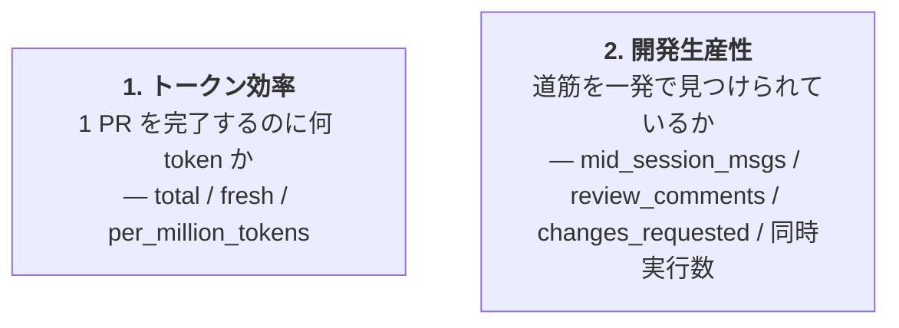
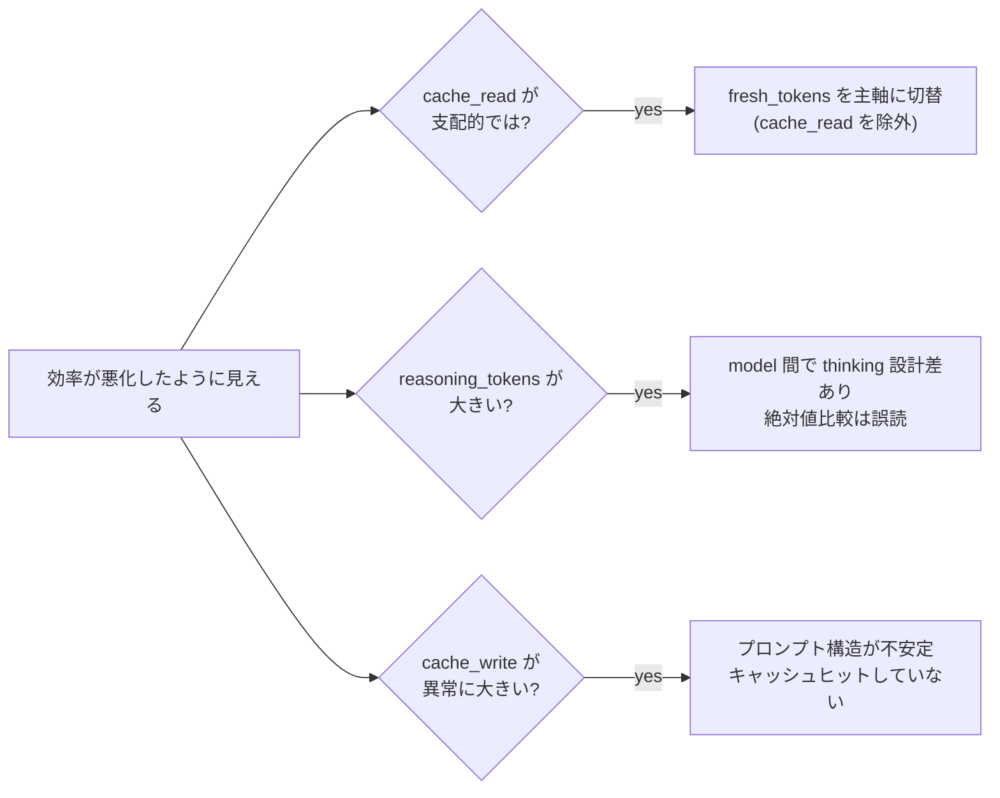
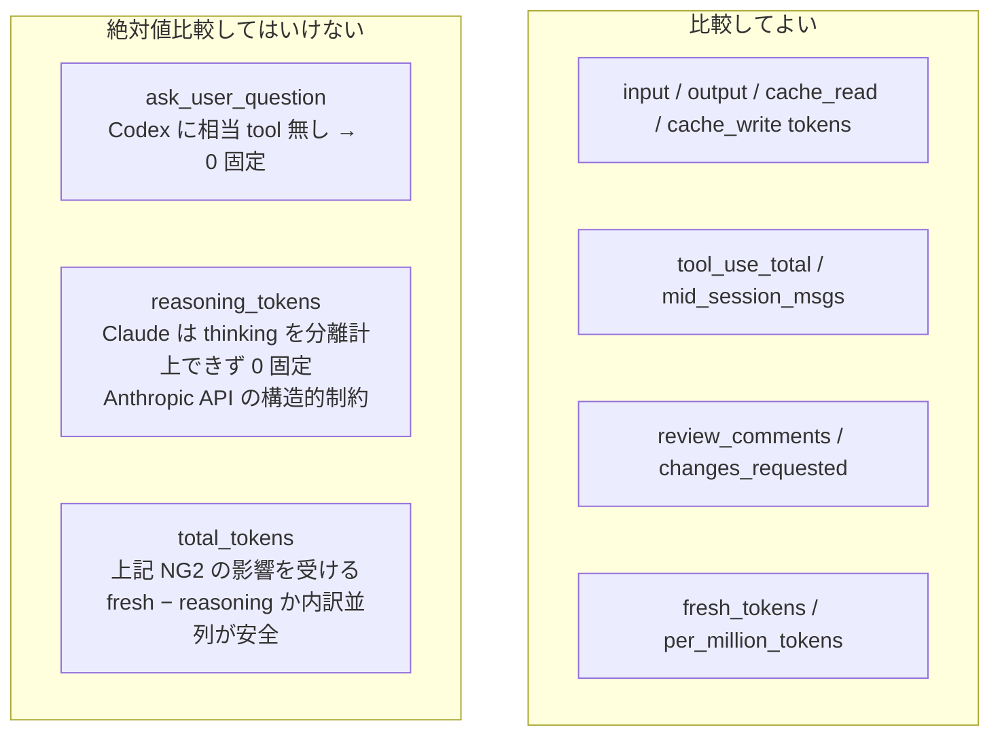
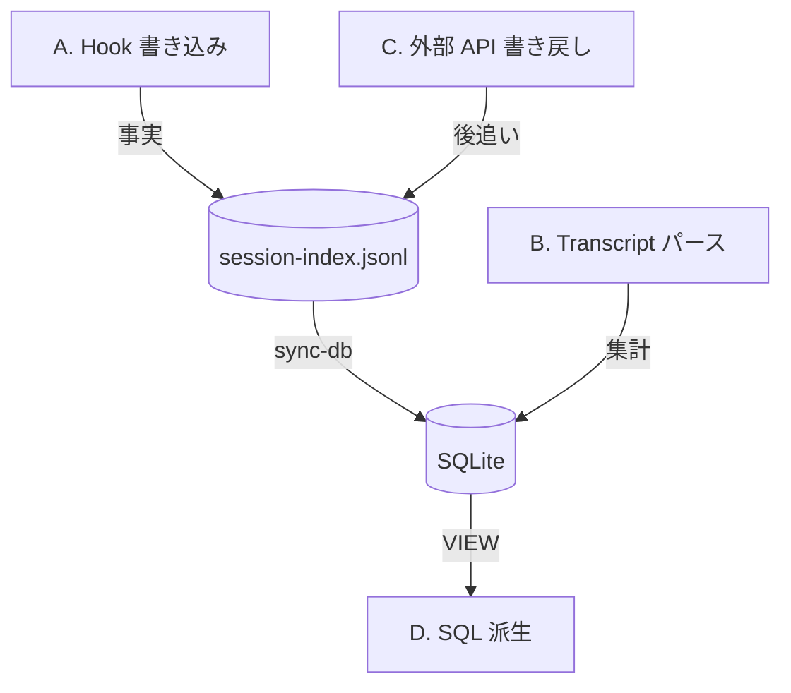

agent-telemetry が **何を観察しているか・なぜそれを選んだか** を整理します。個別メトリクスの型・ラベル・SQL カラムとの対応はすべて [docs/metrics.md](https://github.com/ishii1648/agent-telemetry/blob/main/docs/metrics.md) を正本とし、本ページは「観察軸の見取り図」と「読み誤りやすい落とし穴」に絞ります。

## 観察軸の見取り図

メトリクスは 2 つの主軸で配置されます。`pr_metrics` VIEW のフィルタ（merged のみ・subagent / ghost / dotfiles 除外）はどちらの軸にも効く前提です。

軸ごとに「答えたい疑問」と「主要指標」を並べると次のとおりです。

| 軸 | 答えたい疑問 | 主要指標 |
|---|---|---|
| 1. トークン効率 | 1 PR を完了するのに何 token かかっているか | `agent_pr_total_tokens` / `agent_pr_fresh_tokens` / `agent_pr_per_million_tokens` |
| 2. 開発生産性 | 詰まらず PR をマージまで到達させられているか | `agent_session_mid_session_msgs_total` / `agent_pr_changes_requested` / `agent_concurrent_sessions_peak` |

## 落とし穴: トークン効率

| 落とし穴 | 対処 |
|---|---|
| `cache_read_tokens` が大きい = 効率が良い、と読みがち | 長大なコンテキストで自然と増える側面があるため、**`fresh_tokens` を主軸**にする運用が安全 |
| `total` と `fresh` どちらを使うか迷う | 課金や物理 token 量を見たいなら `total`、実質的な作業量を見たいなら `fresh` |
| `tokens_per_tool_use` の絶対値で良し悪しを判定 | 単独では評価不能。**異常検出と内訳分解の補助**として使う（例: 高 reasoning × 低 tool_use_total = 思考の空回り） |
| `cache_write_tokens` の急増 | キャッシュヒットしておらず毎回書き直している兆候。プロンプト構造の安定性を疑う材料 |
| リファクタ系 PR と feature 系 PR を平均で比較 | 性質が違いすぎる。`task_type` フィルタか PR 別スコアカードで個別に見る |

## 落とし穴: 開発生産性

| 指標 | 高いと何が起きているか | 注意 |
|---|---|---|
| `mid_session_msgs` | エージェントが正しい道筋を見つけられない／ユーザが auto を信用しきれていない | 初手プロンプトの前提・ゴール・制約の明示で減らせる |
| `ask_user_question` | 仕様不明瞭 | **Claude のみ計上**。Codex は 0 固定なので agent 跨ぎ比較不可 |
| `changes_requested` | レビュー差し戻し | 人間レビュアの厳しさ・PR 規模に依存。同一レビュア・同一規模帯での時系列比較が安全 |
| `concurrent_sessions_peak` | 並列度の上限 | peak が高い時期に token 効率が落ちていれば「並列やりすぎ」のサイン |

`ended_at` が空のセッションは現在時刻で打ち切る扱いのため、**進行中セッションを含む時間帯は同時実行数が膨らみます**。

## 落とし穴: agent 間比較

`coding_agent` ラベルで claude / codex を区別できますが、API 構造の差から **絶対値比較してはいけない指標** があります。

agent 跨ぎでは `model` / `agent_version` の混在で平均化が壊れやすいので、**ラベル絞り込みを必ず併用**します。

## 4 収集カテゴリ

メトリクスは 30+ ありますが、**どこで値が確定するか** で 4 つに分類できます。コードを読む際の入口になります。

各カテゴリの中身（値を確定させる層・代表メトリクス）は下の表で対応付けています。

| カテゴリ | 値を確定させる層 | 代表メトリクス |
|---|---|---|
| **A. Hook** | session-index.jsonl への即時 append/update | `started_timestamp_seconds` / `ended_timestamp_seconds` / `parent_session_id` / ラベル群 |
| **B. Transcript** | `agent-telemetry sync-db` 実行時に transcript を後追いパース | token 系全部 / `tool_use_total` / `mid_session_msgs` / `ask_user_question` / `is_ghost` / `model` |
| **C. 外部 API** | `Stop` hook の pin（早期）+ `agent-telemetry backfill` Phase 1/2（後追い） | `pr_url` ラベル / `pr_merged` / `pr_review_comments` / `pr_changes_requested` |
| **D. SQL 派生** | Grafana / 手動クエリ実行時に VIEW を評価 | `is_subagent` / `agent_pr_total_tokens` / `agent_pr_fresh_tokens` / `agent_concurrent_sessions_*` |

カテゴリの境界は **「どこから来るか」だけ見ると曖昧**になります（例: `is_subagent` の元データ `parent_session_id` は A だが、メトリクスとしては D の派生）。**「どの層が値を確定させるか」** で分類するとブレません。

各カテゴリの実装詳細・代表例の追跡は [docs/metrics.md ## 収集パイプライン](https://github.com/ishii1648/agent-telemetry/blob/main/docs/metrics.md#収集パイプライン) を参照してください。データの実際の流れは [data-flow]() ページで時系列に追えます。

## 関連

- [architecture]() — 4 カテゴリを支える 3 層構成
- [hooks]() — カテゴリ A・C の発火点
- [data-flow]() — カテゴリ B のパース詳細と D の集約
- [docs/metrics.md](https://github.com/ishii1648/agent-telemetry/blob/main/docs/metrics.md) — メトリクスカタログ（型・ラベル・SQL カラム対応）
